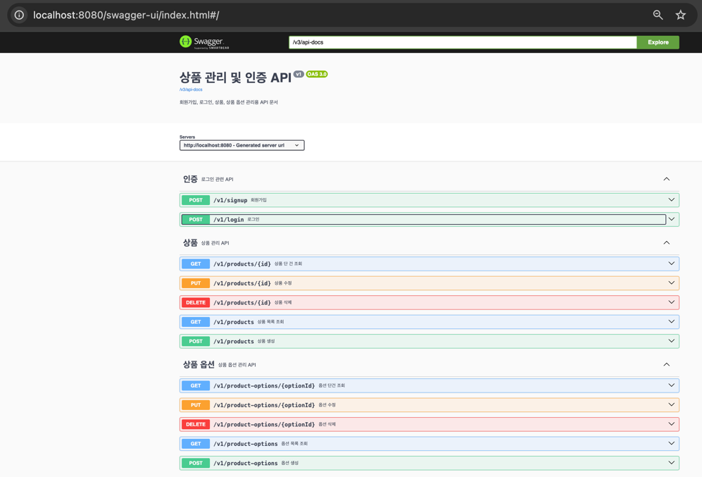

# 상품 관리 프로젝트 (이동기)

상품과 상품 옵션을 효율적으로 관리할 수 있는 API와, 이를 위한 관리자용 프론트엔드 애플리케이션을 함께 제공합니다

## 실행 방법

### 백엔드 애플리케이션
```bash
# 경로 : 프로젝트 루트

# gradlew 권한 부여
chmod +x gradlew

# 빌드
./gradlew clean build

# 실행
java -jar ./build/libs/product-donggi.jar

# +a) Swagger 문서 확인
브라우저 창에 localhost:8080/swagger-ui/index.html#/
```

### 프론트엔드 애플리케이션
```bash
# 경로 : 프로젝트 루트

docker-compose up -d
```

<details>
<summary> 📃 Swagger 실행 확인</summary>
<div markdown="1">

- 브라우저에서 localhost:8080/swagger-ui/index.html 접속



</div>
</details>

<br>

<details>
<summary> 👾 관리자용 프론트엔드 실행 확인</summary>
<div markdown="1">

**브라우저에서 localhost:3000 접속**

- 이메일 : `admin@donggi.lee`
- 비밀번호 : `admin1234`

**대시보드 페이지**

</div>
</details>

## 주요 기능

- **상품 관리**
  - 생성 / 조회 / 수정 / 삭제
  - 페이된 상품 목록 조회
- **상품 옵션 관리**
  - 옵션(이름/타입/추가 가격) 생성 / 조회 / 수정 / 삭제
  - 각 옵션에 연관된 값 리스트 관리
- **인증 / 인가**
  - JWT 기반 로그인 API (/v1/login)
  - 로그인 후 발급된 토큰으로 상품 관리 API, 상품 옵션 관리 API 호출 가능
- **관리자용 프론트엔드**
  - 상품 및 옵션 CRUD UI
  - React + Next.js + TailwindCSS 기반

## 프로젝트 구조

```bash
# ── 프로젝트 루트
src/
    └── main/java/donggi/lee/catalog/
        ├── common/             # 공통 레이어
        │   ├── config/         # 스프링 설정 (Swagger, CORS 등)
        │   ├── domain/         # 공용 도메인 객체
        │   ├── exception/      # 전역 예외 & 핸들러
        │   └── security/       # JWT, 필터, SecurityConfig
        ├── product/            # 상품 도메인
        │   ├── application/    # 상품 응용 서비스
        │   ├── controller/     # REST API 컨트롤러
        │   ├── domain/         # 엔티티/도메인 서비스
        │   ├── exception/      # 상품 관련 예외
        │   └── infrastructure/ # JPA 저장소 구현
        ├── user/               # 사용자/인증 도메인
        │   ├── application/    # 인증/토큰 응용 서비스
        │   ├── controller/     # REST API 컨트롤러
        │   ├── domain/         # 엔티티/도메인 서비스
        │   ├── exception/      # 사용자 관련 예외
        │   └── infrastructure/ # JPA 저장소 구현
        └── CatalogApiApplication.java
    
```

## 주요 구성 요소

**Product 도메인**
1.	**Product**: 판매되는 개별 상품
2.	**ProductOption**: 상품에 최대 3개까지 붙는 옵션(예:사이즈, 색상)
3.	**OptionValue**: 옵션이 가질 수 있는 실제 값(예:“M”, “Red”)
4.	**OptionType(enum)**: 옵션 형태 구분 → SELECT, INPUT

**User 도메인**
1.	**User**: 이메일·비밀번호로 로그인하는 시스템 사용자
2.	**RefreshToken**: 사용자별 리프레시 토큰 보관
3.	**Tokens(VO)**: 액세스/리프레시 토큰 쌍 반환용

## 프로젝트 설계 의도

### 1. 기능 중심 모듈화와 패키지 구조

기능별 응집도와 독립적인 확장을 고려하여 패키지를 구성하였습니다. 주요 기능인 product와 user는 catalog 하위의 독립적인 패키지로 분리하여 기능별 응집도를 높였습니다.  

이러한 구조는 확장에 유리하여, 새로운 기능을 추가할 때 기존 패키지에 영향을 주지 않고 독립적으로 개발할 수 있습니다. 또한 각 기능 패키지 내부는 DIP 원칙을 따르는 계층 구조로 설계되어 있어, 기술 변경이나 선택이 다른 기능에 영향을 최소화하도록 구성되어 있습니다. 

### 2. DIP 기반 계층형 아키텍처 설계

각 기능을 controller → application → domain → infrastructure 계층으로 나누어 구성하며, 이 중 DIP(의존성 역전 원칙) 은 domain과 infrastructure 계층 간의 의존성을 효과적으로 분리하는 데 중점을 둡니다.

domain 계층에서는 필요한 인터페이스를 정의하고, infrastructure 계층에서는 이를 구현하여 핵심 로직이 구체적인 기술 구현으로부터 분리되도록 구성하였습니다. 예를 들어, JPA에서 MyBatis로 ORM 기술을 변경하더라도, domain 계층은 저장소 구현 방식에 의존하지 않기 때문에 비즈니스 로직은 변경 없이 그대로 유지됩니다.  

이러한 구조는 기술 변경에 유연하게 대응할 수 있는 동시에, 핵심 도메인의 안정성과 일관성을 보장합니다.


### 3. Facade 패턴을 활용한 복합 유스케이스의 효율적 처리

본 프로젝트에서는 ‘상품 옵션’과 ‘옵션 값’처럼 여러 컴포넌트에 걸친 유스케이스를 효과적으로 관리하기 위해 Facade 패턴을 적용하였습니다. 이 패턴은 관련된 하위 시스템이나 서비스 간의 복잡한 상호작용을 하나의 인터페이스로 통합함으로써, 클라이언트 측의 복잡도를 줄이고 내부 컴포넌트 간 결합도를 낮추는 데 도움이 됩니다.  

예를 들어, 옵션을 생성한 후 해당 결과를 기반으로 옵션 값을 등록해야 하는 경우, Facade가 이 과정을 순차적으로 처리합니다. 클라이언트는 개별 컴포넌트의 내부 동작을 알 필요 없이, 제공된 Facade 인터페이스만으로 필요한 작업을 간편하게 수행할 수 있습니다.  

이러한 구성은 복잡한 비즈니스 로직을 명확히 분리하고, 각 컴포넌트가 본래의 책임에 집중할 수 있도록 합니다. 결과적으로 유지보수 부담을 줄이고, 로직 변경이나 신규 기능 추가 시에도 유연하게 대응할 수 있는 구조를 확보할 수 있습니다.  
